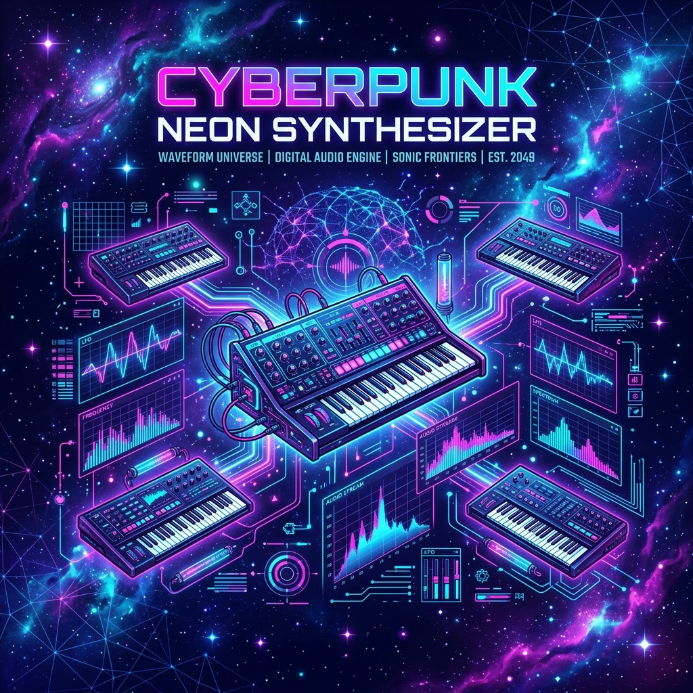

# 🌌 NebulaSynth

> A stunning, interactive, and fully procedural Web Audio Synthesizer and Step Sequencer built with raw Vanilla JS, HTML5 Canvas, and modern Glassmorphism CSS.



NebulaSynth is a zero-dependency web audio workspace designed to demonstrate complex browser-based audio synthesis, real-time visual rendering, and hardware-style UI interactions. It features a fully playable virtual keyboard, a high-precision step sequencer, synthesizer controls (including ADSR envelopes, lowpass filters, and space delays), and a live dual-mode visualizer.

## 🚀 Live Demo
You can deploy this repository directly on **GitHub Pages** with zero configuration!
*   **Demo URL:** `https://<your-username>.github.io/<repository-name>/`

---

## ✨ Key Features

*   **Procedural Audio Engine**: No samples, audio files, or external audio dependencies. Kick drums, snare snaps, metallic hi-hats, synth leads, and basslines are synthesized entirely on the fly using Web Audio API nodes.
*   **High-Precision Step Sequencer**: Built with a double-buffer lookahead scheduling algorithm to maintain microsecond-accurate timing across different browser loads.
*   **Custom Synthesizer Controls**:
    *   **Oscillators**: Selectable waves (Sine, Triangle, Sawtooth, Square).
    *   **ADSR Envelope**: Hardware faders for Attack, Decay, Sustain, and Release times.
    *   **Biquad Filter**: Cutoff frequency and resonance dials.
    *   **Space Delay**: Wet delay feedback effect with custom time buffers.
*   **Dual-Mode Visualizer**:
    *   *Waveform mode*: Real-time time-domain oscilloscope wave line.
    *   *Spectrum mode*: Mirror frequency bar representation with custom neon gradients.
    *   *Reactivity*: Visual starfields warp and speed up depending on active volume levels.
*   **Interactive Virtual Keyboard**: Playable with mouse, touch events, or mapped computer keys (Octave C4-B4).
*   **Hardware-Inspired Aesthetics**: A modern glassmorphic cyberpunk layout, custom radial dials, glowing active indicators, and flowing CSS background ambient lights.

---

## 🎹 Keyboard Mappings

Play the synthesizer using your computer's keyboard:

| Note | Key | Note | Key |
|---|---|---|---|
| **C4** | `A` | **F#4** | `T` |
| **C#4** | `W` | **G4** | `G` |
| **D4** | `S` | **G#4** | `Y` |
| **D#4** | `E` | **A4** | `H` |
| **E4** | `D` | **A#4** | `U` |
| **F4** | `F` | **B4** | `J` |

### General Controls
*   `Spacebar`: Start / Pause the step sequencer.
*   `Escape`: Clear the current sequencer grid.

---

## 🛠️ Built With

*   **HTML5**: Structural semantic layouts.
*   **CSS3**: Custom hardware faders, glassmorphism, responsive grid layouts, and custom radial dial indicator rotate transformations.
*   **JavaScript (ES6+)**: Custom Web Audio API framework, HTML5 Canvas drawing, and event coordinators.

---

## 📦 How to Run Locally

Since this project uses modern ES6 modules and Web Audio features:
1. Clone the repository:
   ```bash
   git clone https://github.com/your-username/nebula-synth.git
   ```
2. Navigate to the project folder:
   ```bash
   cd nebula-synth
   ```
3. Open `index.html` in your browser. Since it has no external assets or dynamic imports, it can run directly from the filesystem (double-click `index.html`), but serving it with a local server (e.g., Live Server in VS Code, or `npx serve`) is recommended for the best experience.

---

## 🌟 Showcase & Portfolio Highlights

If you're using this project to showcase your frontend development capabilities:
*   **Audio Synthesis**: Highlights advanced knowledge of the Web Audio API, including scheduling nodes (`setValueAtTime`, `exponentialRampToValueAtTime`), buffers, oscillators, filters, delay loops, and analyser nodes.
*   **Performance Optimization**: Showcases high-frequency animations utilizing `requestAnimationFrame` and low-overhead Canvas operations.
*   **Interactive Design**: Demonstrates custom CSS component design (such as vertical sliders and rotating dial plates) that translate mouse interactions into exact CSS transformations.

---

Created with 🌌 by [Your Name](https://github.com/your-username).
